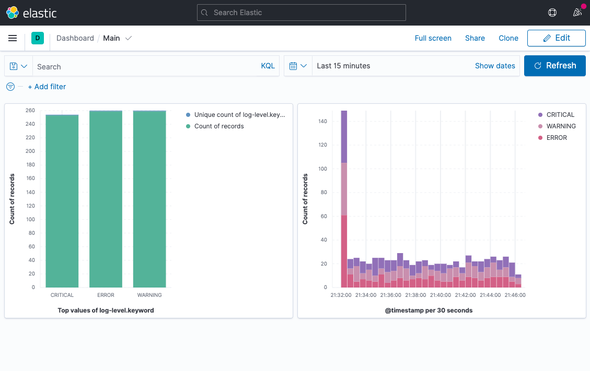

# 📊 ELK Stack

By Anthony Vilarim Caliani


This is a PoC where I've explored a little beat of the ELK Stack.  

```bash
# Starting services...
# Kibana URL: http://localhost:5601
docker-compose up -d
```

Checking docker logs...

```bash
docker ps
docker logs py-app
```

When you finsh... Press `Ctrl+C` and...

```bash
docker-compose down
```

## Screenshot



## Related Links
s
- [ELK Configuration](http://blog.aeciopires.com/instalando-o-elastic-kibana-e-logstash-via-docker/)
- [Send Logs via LogStash](https://www.freecodecamp.org/news/how-to-use-elasticsearch-logstash-and-kibana-to-visualise-logs-in-python-in-realtime-acaab281c9de/)
