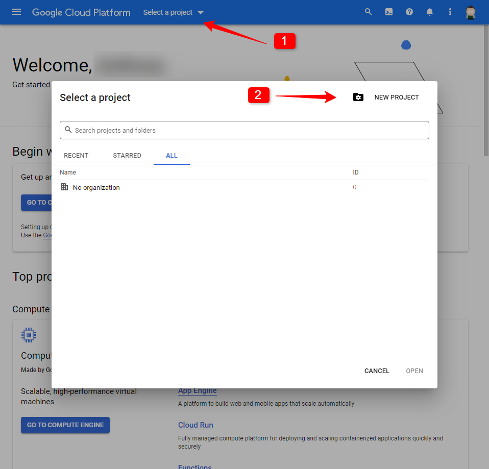
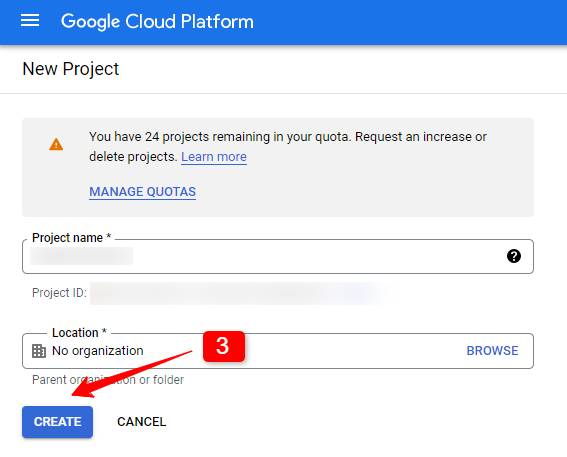
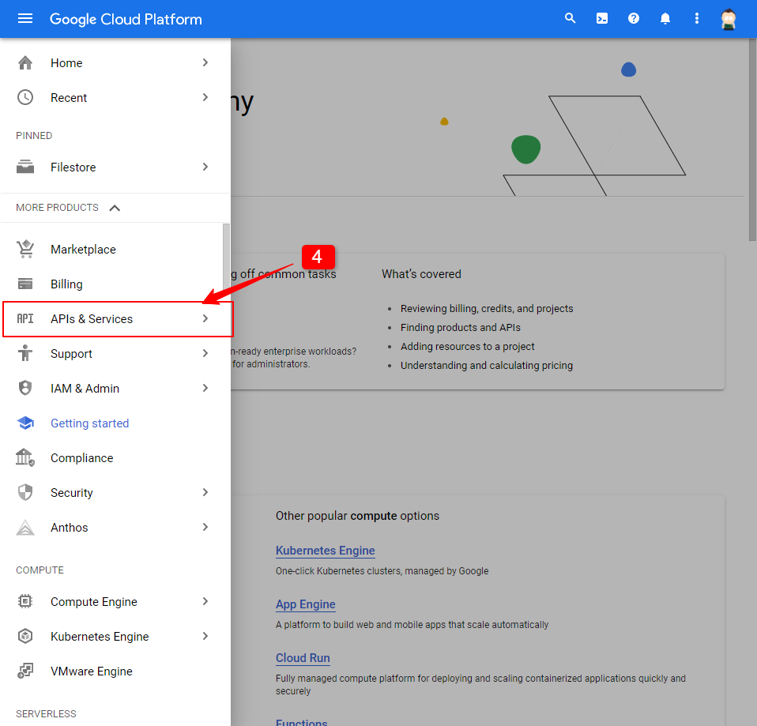
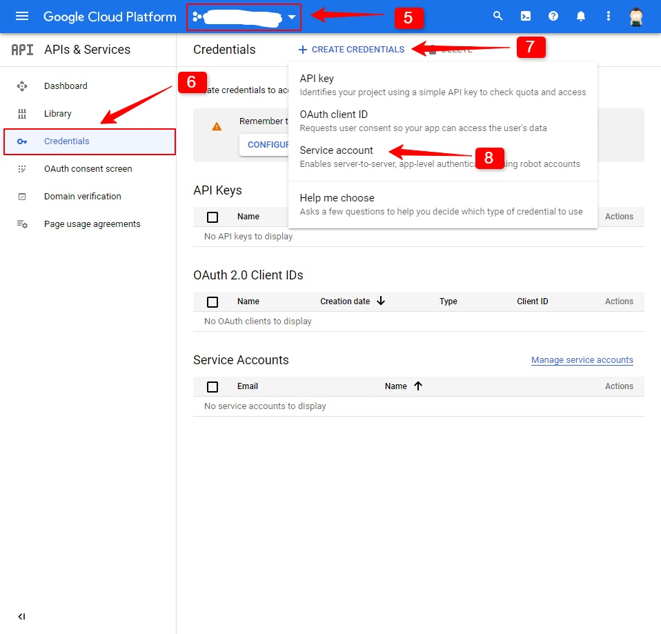
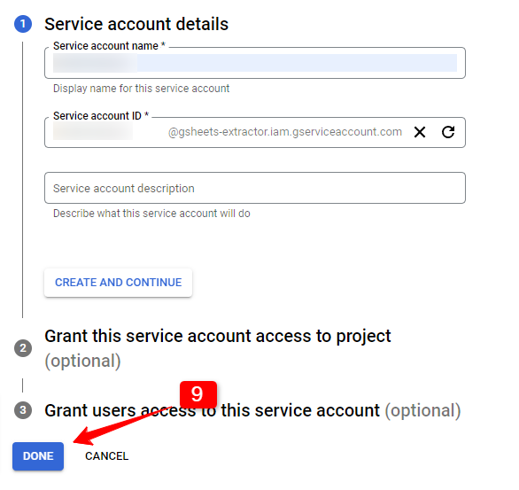
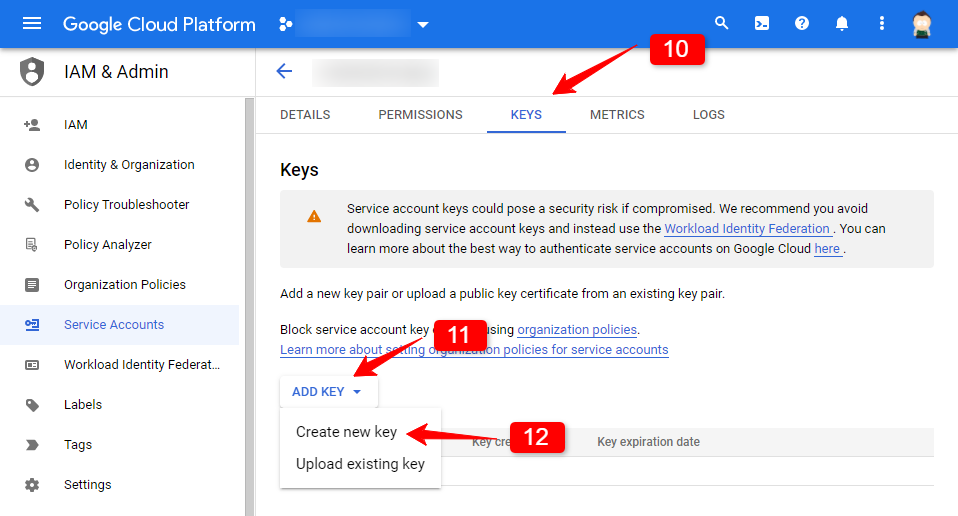
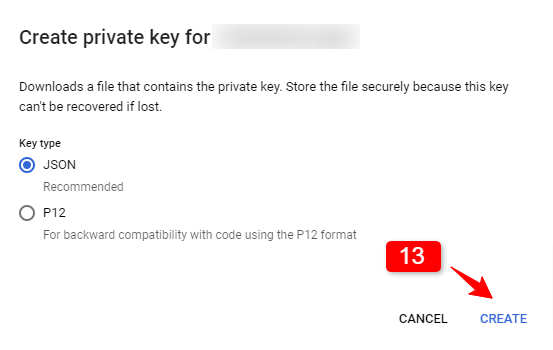
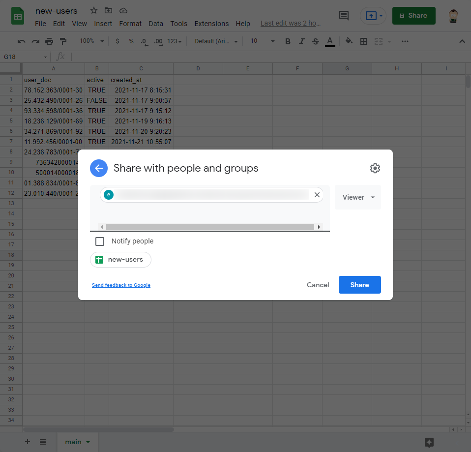
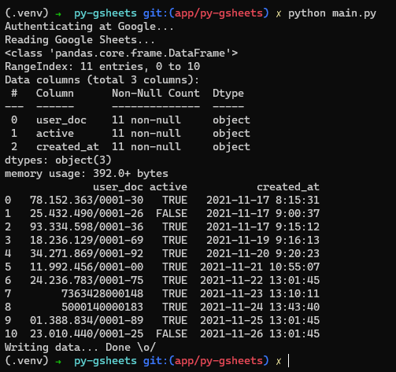

# 📉 Py GSheets

By Anthony Vilarim Caliani


This is an example of reading Google Sheets data.

## Quick Start

Installing project dependencies.

```bash
python -m venv .venv \
  && source .venv/bin/activate \
  && python -m pip install --upgrade pip \
  && poetry install
```

### Configuring Google Cloud

I know that there are other ways to authenticate and retrieve the same results, but here I'm going to show how it worked
for me.

This step-by-step guide was updated on 20/11/2021.

First, go to [GCP Console](https://console.cloud.google.com/getting-started). Then, create your project.





---

When you go to APIs & Services click on "Enable API", then at search field look after "sheets" and enable Google Sheets
API.

Now, it's time to create your credentials.

---





---

After creating the service account, you will realize that it looks like an e-mail, save it because we are going to use
this "email address" later.<br>
Now, click on it, you will be redirected to Google IAM page.

---




---

After that, a JSON file should be downloaded with your credentials. Then, you have to move the JSON file to project root
and rename it to `credentials.json`.

Finally, at Google Sheets, share you sheets with you Service Account "email".

---



---

Executing the main script.

```bash
python main.py
```



### References

- [Google Developers: GSheets Python Quick Start](https://developers.google.com/sheets/api/quickstart/python)
- [Google Developers: New Project + Enable API](https://developers.google.com/workspace/guides/create-project)
- [Google Developers: Create Credentials](https://developers.google.com/workspace/guides/create-credentials)
- [Medium: Read and Write GSheets](https://medium.com/analytics-vidhya/how-to-read-and-write-data-to-google-spreadsheet-using-python-ebf54d51a72c)
- [Medium: Reading GSheets with gspread](https://medium.com/@vince.shields913/reading-google-sheets-into-a-pandas-dataframe-with-gspread-and-oauth2-375b932be7bf)
