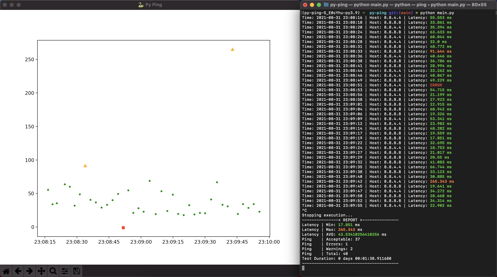

# 🕹 Py Ping


## Quick Start

```bash
# Install project dependencies
poetry install

# Check where are your venv
poetry env info

# Activate virtual environment
source $path_to_python_venv

# Let's go \o/
./main.py

# Help 
./main.py -h 

# All Options
./main.py \
  --duration 60 \
  --cmd 'ping -t 1 <HOST>' \
  --pattern '.*time=(\d+\.?\d*)\sms' \
  --hosts '8.8.8.8' '8.8.4.4' \
  --sleep 3 \
  --max-ping 50 \
  --no-chart
```

## Screenshots


